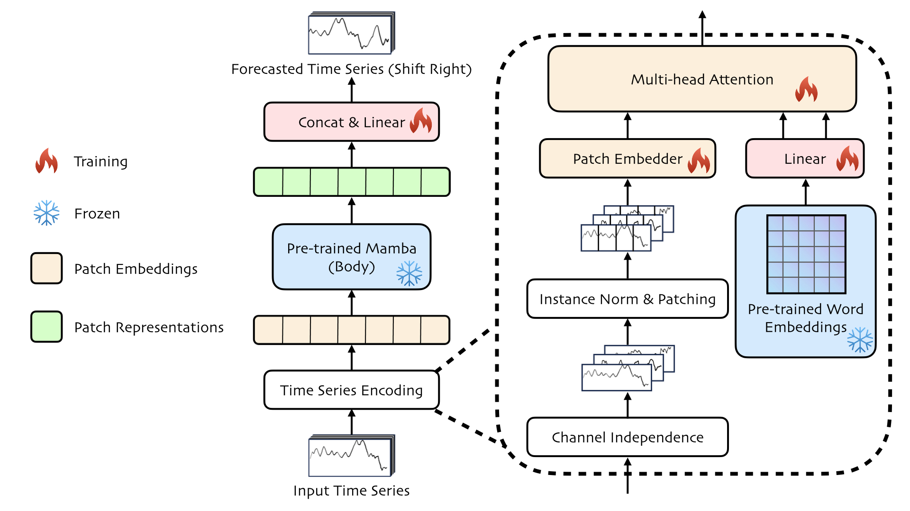
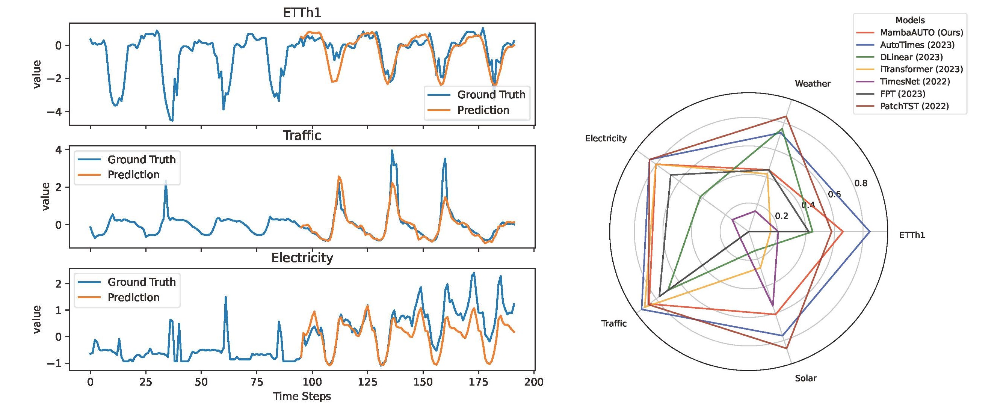

<div align="center">
  <!-- <h1><b> Time-LLM </b></h1> -->
  <!-- <h2><b> Time-LLM </b></h2> -->
  <h2><b> MambaAUTO: Mamba as Autoregressive Time Series Forecasters </b></h2>
</div>

## 1. Introduction
We proposed a novel framework leveraging newly published Pretrained Language Model, Mamba, to solve time series forecasting tasks.  
The input time series will first pass the instance norm layer, and then be divided into patches
for easier local information capture. A multimodal block will then be in charge of encoding them into
embeddings that can align the inputs better with the LLM inputs. The embeddings will then be fed into
the backbone for encoding and feature extraction. The output will then pass a linear layer to match the
output window size.



## 2. Performance
MambaAUTO has demonstrated strong capabilities on different kinds of time series forecasting tasks. It outperforms TimesNet and FPT on all 5 benchmarks and outperforms DLinear and iTransformer on 4 benchmarks. However, our model does not outperform AutoTimes and PatchTST, which are the current state-of-the-art models.



## 3. Data
|             | Features                                             | Sample Rate | Time Range |
| ----------- | ---------------------------------------------------- | ----------- | ---------- |
| ETTh1       | 7 Electricity Transformer Factors (e.g. Temperature) | 1 hour      | 2016-18    |
| Weather     | 21 Meteorological Factors (e.g., CO2 concentration)  | 10 mins     | 2020       |
| Electricity | 321 Clients’ Electricity consumption                 | 1 hour      | 2012-14    |
| Traffic     | 862 Freeway Sensors Data of Bay Area                 | 1 hour      | 2015-16    |
| Solar       | 137 Photovoltaic (PV) Plants’ Solar Power Production | 10 mins     | 2006       |

### To download the datasets:  
You can access the well pre-processed datasets from [[Google Drive]](https://drive.google.com/file/d/1NF7VEefXCmXuWNbnNe858WvQAkJ_7wuP/view?usp=sharing), then place the downloaded contents under `./dataset`


## 4. How to run codes
### To install all dependencies:
```
pip install -r requirements.txt
```

### To train the model and run testing, you can use the following commands as examples, in which weather can be replaced with other datasets, such as electricity, traffic, etc.:
```
python3 train.py --model="Mamba-130m" --data="custom" --root_path="./dataset/weather/" --data_path="weather.csv" --test_pred_len=96 --d_k=96 --nhead=8 --batch_size=64
```
The resulting MSE and MAE loss will be saved in the `result_long_term_forecast.txt`.
